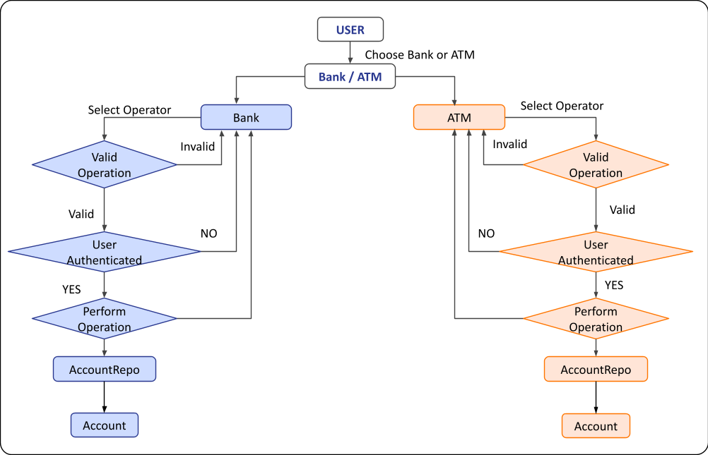
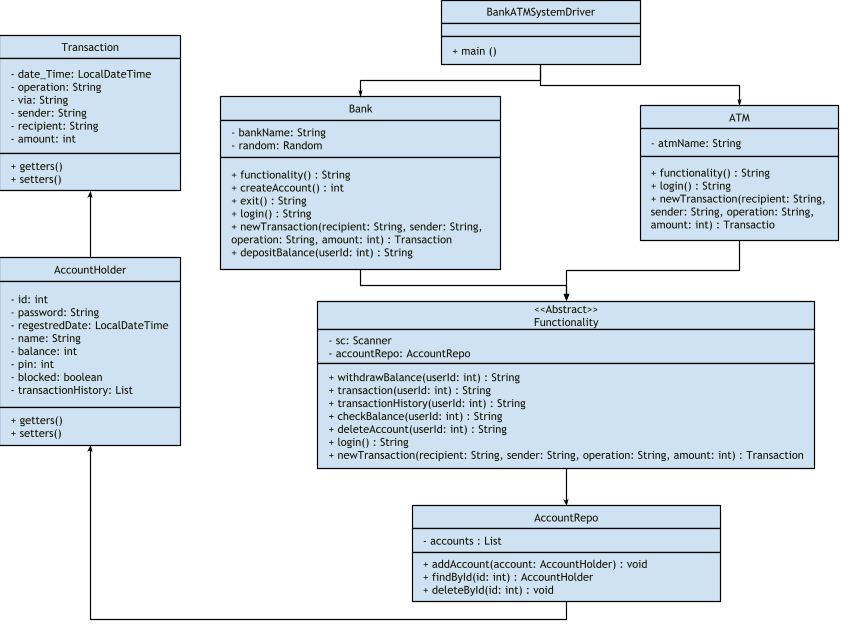

# **Project Name: ATM-System Project**
## **Technology: Java**
## **Project Type: Console Based**
___
## **Project Description :**
### **Project Structure:**
1. The main Java package for the program is **"com.atm"**.
2. The program consists of multiple classes: **Driver, Bank, ATM, AccountHolder, Transaction, AccountRepo, and Functionality**.
3. The **Driver class** contains the main method that serves as the entry point of the program.
3. The **Bank class** represents the banking functionality and extends the Functionality class.
4. The **ATM class** represents the ATM functionality and extends the Functionality class.
5. The **AccountHolder class** represents an individual account holder and stores their account details.
6. The **Transaction class** represents a single transaction and stores information such as the date/time, operation type, sender, recipient, and amount.
7. The **AccountRepo class** is a repository for storing and retrieving AccountHolder objects.
8. The **Functionality class** is an abstract class that provides common functionality for banking operations and is extended by the Bank class.

This Java program represents an ATM system implemented using object-oriented principles. It allows users to interact with either the bank or the ATM functionality by selecting options from a menu. The program utilizes the Bank and ATM classes to handle the respective functionalities.

## **High Level Diagram**

## **UML Diagram**

## **BankATMSystemDriver Class**
### **BankATMSystemDriver Class Structure:**
The program is located in the *com.atm* package.
The main entry point of the program is the **BankATMSystemDriver class**, which contains the ***main*** method.
The program uses a Scanner object to read user input from the console.
It includes two main classes: **Bank** and **ATM**.
The Bank class handles bank-related functionalities, while the ATM class handles ATM-related functionalities.
Running the Program:

To run the program, execute the main method in the Driver class.
The program presents a menu with three options: 
1. Bank
2. ATM
3. Exit

Enter the corresponding number for the given option.
If an invalid input is entered, the program prompts for a valid input until a valid option is selected.
1. Selecting the **Bank** option will call the functionality method of the Bank class, which performs bank-related operations and returns a response.
2. Selecting the **ATM** option will call the functionality method of the ATM class, which performs ATM-related operations and returns a response.
3. Selecting the **Exit** option terminates the program.

**Bank Functionality:**
1. The Bank class provides various banking operations such as creating an account, deleting an account, depositing balance, withdrawing balance, checking balance, making transactions, and viewing transaction history.
2. When the Bank option is selected, the program calls the functionality method of the Bank class, which prompts the user to choose from different banking operations. After executing the selected operation, a response is displayed.

**ATM Functionality:**
1. The ATM class handles ATM-related operations, which are not explicitly described in the provided code snippet.
2. When the ATM option is selected, the program calls the functionality method of the ATM class, which performs the ATM-related operations and returns a response.

**Exiting the Program:**

Selecting the Exit option will display a farewell message and terminate the program.

## **Bank Class**
### **Bank Class Structure:**
1. The Bank class extends the Functionality class.
2. The program uses the AccountRepo class to manage user accounts
3. The program includes a Random object for generating random user IDs.
4. A Scanner object is used to read user input from the console.

**Bank Functionality:**

The Bank class provides the following banking operations:

**NOTE :** Each functionality program prompts the user to enter their user **ID** and **password** except **Creating an Account** and **Exiting**.

**Creating an Account:**

The program prompts the user to provide account details such as **name**, **password**, and **PIN**.

A unique user ID is generated using the Random object.
The account is added to the **AccountRepo class**, and the generated user ID is returned.

**Deleting an Account:**

If the provided credentials are correct, the account is deleted from the AccountRepo class.

**Depositing Balance:**

If the provided credentials are correct, the program prompts the user to enter the amount to deposit.
The specified amount is added to the user's account balance, and the updated balance is returned.

**Withdrawing Balance:**

If the provided credentials are correct, the program prompts the user to enter the amount to withdraw.

The specified amount is subtracted from the user's account balance, and the updated balance is returned.

**Balance Inquiry:**

If the provided credentials are correct, the user's account balance is retrieved and returned.

**Transaction:**

If the provided credentials are correct, the program allows the user to perform a transaction.
The details of the transaction are recorded and returned.

**Transaction History:**

If the provided credentials are correct, the user's transaction history is retrieved and returned.

**Exiting the Program:**

When the "Exit" option is selected, a farewell message is returned, and the program terminates.

## **ATM Class**
### **ATM Class Structure:**

1. The ATM class extends the Functionality class.
2. The program includes an AccountRepo class for managing user accounts.
3. A Scanner object is used to read user input from the console.

**ATM Functionality:**
The ATM class provides the following ATM operations:

**NOTE :** Each functionality program prompts the user to enter their user **ID** and **password** except **Exiting**.

**Withdraw Balance:**

If the provided credentials are correct, the program proceeds with the withdrawal process.

The user is then prompted to enter the amount to withdraw.

The specified amount is subtracted from the user's account balance, and the updated balance is returned.

**Balance Inquiry:**

If the provided credentials are correct, the user's account balance is retrieved and returned.

**Transaction:**

If the provided credentials are correct, the program allows the user to perform a transaction.

The details of the transaction, including recipient, sender, amount, date and time, and operation, are recorded and returned.

**Exiting the Program:**

When the "Exit" option is selected, a farewell message is returned, and the program terminates.

## **Functionality Class**
### **Functionality Abstract Class Structure:**

1. The Functionality is an abstract class that provides the basic functionality for an ATM Class and Bank Class.
2. The program includes a Scanner object for reading user input from the console.
3. An AccountRepo object is created for managing user accounts.

**Abstract Methods:**

The Functionality class declares the following abstract methods that must be implemented by concrete subclasses:

1. **login():** Performs the login process for the ATM system.
2. **newTransaction(String recipient, String sender, String operation, int amount):** Creates a new transaction object.

**Withdraw Balance:**

The withdrawBalance method allows users to withdraw funds from their bank account.

The user is prompted to enter the amount to withdraw.

If the entered amount is valid and the user has sufficient balance, the specified amount is subtracted from the user's account balance.

The account is then updated, and a new transaction record is created for the withdrawal.

**Transaction:**

The transaction method allows users to perform a transaction with another account.

The user is prompted to enter the recipient's ID and the amount to transact.

If the recipient account exists and the user has sufficient balance, the specified amount is transferred from the user's account to the recipient's account.

Both accounts are updated, and transaction records are created for both the sender and the recipient.

**Transaction History:**

The transactionHistory method retrieves and displays the transaction history for a given user.

The user's transaction history is obtained from the AccountHolder object and displayed on the console.

If the transaction history is empty, a corresponding message is returned.

**Check Balance:**

The checkBalance method allows users to check the balance of their bank account.

The user's account balance is retrieved and returned as a string.

**Delete Account:**

The deleteAccount method deletes a user account based on the provided user ID.

The method returns a string indicating whether the account was successfully deleted or not.

## **AccountHolder Class**
**Attributes:**

1. **id:** An integer representing the unique identifier of the account holder.
2. **password:** A string representing the password associated with the account holder's account.
3. **pin:** An integer representing the 6-digit PIN associated with the account holder's account.
4. **name:** A string representing the name of the account holder.
5. **registeredDate:** A LocalDate object representing the date when the account was registered.
6. **balance:** An integer representing the current balance in the account.
7. **blocked:** A boolean indicating whether the account is blocked due to multiple failed login attempts.
8. **transactionHistory:** A list of Transaction objects representing the transaction history for the account holder.

**Getters and Setters:**

Getters and setters are provided for all attributes to access and modify their values.

Note:

The regestredDate attribute is initialized with the current date using the LocalDate.now() method when setRegestredDate() is called.

The transactionHistory attribute is initialized as an empty list, and it can be modified using the corresponding setter method.

## **Transaction Class**
**Attributes:**
1. **date_Time:** A LocalDateTime object representing the date and time when the transaction occurred.
1. **operation:** A string representing the type of operation performed in the transaction (e.g., "Withdraw", "Deposit", "Transact").
1. **via:** A string representing the medium through which the transaction was processed (e.g., ATM name).
1. **sender:** A string representing the sender of the transaction.
1. **recipient:** A string representing the recipient of the transaction.
1. **amount:** An integer representing the amount involved in the transaction.

**Getters and Setters:**

Getters and setters are provided for all attributes to access and modify their values.

Note:

The date_Time attribute is initialized with the current date and time using the LocalDateTime.now() method when setDate_Time() is called.

## **AccountRepo Class**
The AccountRepo class is responsible for managing and storing AccountHolder objects, which represent user accounts in the ATM system.

**Attributes:**

**accountHolder:** A *list* of AccountHolder objects representing the user accounts stored in the repository.

**Methods:**
1. **addAccount:** Adds an AccountHolder object to the repository by appending it to the accountHolder list.
2. **findById:** Finds and returns an AccountHolder object from the repository based on the provided id. It iterates through the accountHolder list and checks if the id matches the id of any account. If a match is found, the corresponding AccountHolder object is returned; otherwise, it returns null.
3. **deleteById:** Deletes an AccountHolder object from the repository based on the provided id. It iterates through the accounts list, searches for an account with a matching id, and removes it from the list. If the deletion is successful, it returns true; otherwise, it returns false.